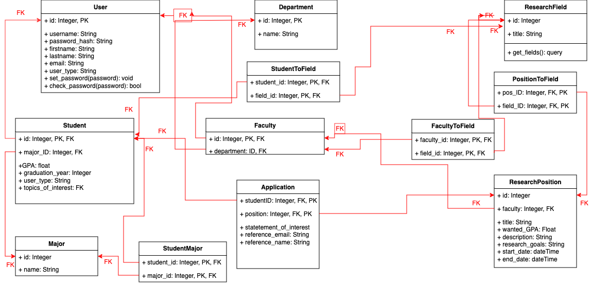

# Project Design Document

## ReConnect

---

Prepared by:

- `Jonathan Buwembo`,`AgileCodesters`
- `Amber Drinkwater`,`AgileCodesters`
- `Dennis Field`,`AgileCodesters`
- `Connor Jason`,`AgileCodesters`
- `Myrrh Khan`,`AgileCodesters`

---

**Course** : CS 3733 - Software Engineering

**Instructor**: Sakire Arslan Ay

---

## Table of Contents

- [Project Design Document](#project-design-document)
  - [Your Project Title](#your-project-title)
  - [Table of Contents](#table-of-contents)
    - [Document Revision History](#document-revision-history)
- [1. Introduction](#1-introduction)
- [2. Component-level Design](#2-component-level-design)
  - [2.1 Model](#21-model)
  - [2.2 Controller](#22-controller)
  - [2.3 View and User Interface Design](#23-view-and-user-interface-design)
- [3. References](#3-references)
- [Appendix: Grading Rubric](#appendix-grading-rubric)

### Document Revision History

| Name       | Date       | Changes       | Version |
| ---------- | ---------- | ------------- | ------- |
| Revision 1 | 2024-04-01 | Initial draft | 1.0     |
| Revision 2 | 2024-04-01 | Added names   | 1.01    |
| Final Revision | 2024-04-13 | Made final changes to document | 2.0 |

# 1. Introduction

With the completion of the scope of the project, it is pertinent to discuss how the project will be completed. Specifically, clarifying the desired routes, the form of the models to be used, and the method in which the User Interface (UI) will be created.

# 2. Component-level Design

(**Note**: You should describe the design for the end product (completed application) - not only your iteration1 version. You will revise this document and add more details later.)

### 2.1 Model

**Provide a list of your tables (i.e., SQL Alchemy classes) in your database model and briefly explain the role of each table.**

- User: A superclass that defines all information that any user would have (username, email...)
- Student: stores information about students, subclass of User.
- Faculty: stores information about professors, subclass of User.
- Major: stores student's major
- StudentMajor: links students to their major
- ResearchPosition: stores information about research projects.
- Applications: links students to a research position they have applied to
- StudentToField: link students to research fields they are interested in
- FacultyToField: link faculty to research fields they are interested in
- Department: Represents the various departments faculty could be a part of
- ResearchField: Represents different topics that students and faculty could be interested in
- PositionToField: Relates ResearchPosition to ResearchFields

Provide a UML diagram of your database model showing the associations and relationships among tables.

### 2.2 Controller

Include a detailed description of the routes your application will implement.

- Brainstorm with your team members and identify all routes you need to implement for the **completed** application.
- For each route specify its “methods”, “URL path”, and “a description of the operation it implements”.  
  You can use the following table template to list your route specifications.

|     | Methods  | URL Path                | Description                                  |
| :-- | :------- | :---------------------- | :------------------------------------------- |
| 1.  | GET POST | /index                  | Homepage                                     |
| 2.  | GET POST | /register/student       | Allow students to register                   |
| 3.  | POST     | /apply/<position_id>    | Where students can create an application     |
| 4.  | GET POST | /position/<position_id> | Displays a research opportunity              |
| 5.  | GET POST | /register/faculty       | Allow faculty to register                    |
| 6.  | GET POST | /login                  | Allow all users to log in                    |
| 7.  | GET      | /logout                 | Allow all users to log out                   |
| 8.  | GET POST | /create_position        | Allow professors to create new opportunities |
| 9.  | POST     | /unapply/<position_id>  | Where students can unapply                   |
| 10. | GET      | /profile                | Displays user profile                        |
| 11. | GET POST | /profile/edit           | Allows users to edit their profile           |

### 2.3 View and User Interface Design

Explain how you plan to build the user interfaces and mention the frameworks/libraries you plan to use (e.g., Bootstrap).

We plan to implement Bootstrap to do most, if not, all of the styling in this project. Bootstrap is very quick to style webpages with and ensures all styling is clean and consistent throughout the entirety of the project. Similarly, we will be using WTForms to create simple forms to gather and handle user input on our website. We will also use the Moment library to easily format dates and times we encounter in this project. We will make use of Flask Login in our program to handle authentication of users. Lastly, we will be using Werkzeug's security library to handle password hashing for easy and safe storage of login credentials.

Provide a list of the page templates you plan to create and supplement your description with UI sketches or screenshots. Make sure to mention which user-stories in your “Requirements and Use Cases" document will utilize these interfaces for user interaction.

# 3. References

Cite your references here.

For the papers you cite give the authors, the title of the article, the journal name, journal volume number, date of publication and inclusive page numbers. Giving only the URL for the journal is not appropriate.

For the websites, give the title, author (if applicable) and the website URL.

---

# Appendix: Grading Rubric

(Please remove this part in your final submission)

- You will first submit a draft version of this document:
  - "Project 3 : Project Design Document - draft" (5pts).
- We will provide feedback on your document and you will revise and update it.
  - "Project 5 : Project Design Document - final" (80pts)

Below is the grading rubric that we will use to evaluate the final version of your document.

| **MaxPoints** | **Design**                                                                                                                                                                                                                                      |
| :-----------: | :---------------------------------------------------------------------------------------------------------------------------------------------------------------------------------------------------------------------------------------------- |
|               | Are all parts of the document in agreement with the product requirements?                                                                                                                                                                       |
|      10       | Is the model (i.e., “database model”) explained well with sufficient detail? Do the team clearly explain the purpose of each table included in the model?                                                                                       |
|       5       | Is the document making good use of semi-formal notation (i.e., UML diagrams)? Does the document provide a clear UML class diagram visualizing the DB model of the system?                                                                       |
|      17       | Is the UML class diagram complete? Does it include all classes (tables) and does it clearly mark the PK and FKs for each table? Does it clearly show the associations between them? Are the multiplicities of the associations shown correctly? |
|      25       | Are all major interfaces (i.e., the routes) listed? Are the routes explained in sufficient detail?                                                                                                                                              |
|      15       | Is the view and the user interfaces explained well? Did the team provide the screenshots of the interfaces they built so far.                                                                                                                   |
|               | **Clarity**                                                                                                                                                                                                                                     |
|               | Is the solution at a fairly consistent and appropriate level of detail? Is the solution clear enough to be turned over to an independent group for implementation and still be understood?                                                      |
|       5       | Is the document carefully written, without typos and grammatical errors?                                                                                                                                                                        |
|       3       | Is the document well formatted? (Make sure to check your document on GitHub. You will loose points if there are formatting issues in your document. )                                                                                           |
|               |                                                                                                                                                                                                                                                 |
|      80       | **Total**                                                                                                                                                                                                                                       |
|               |                                                                                                                                                                                                                                                 |
