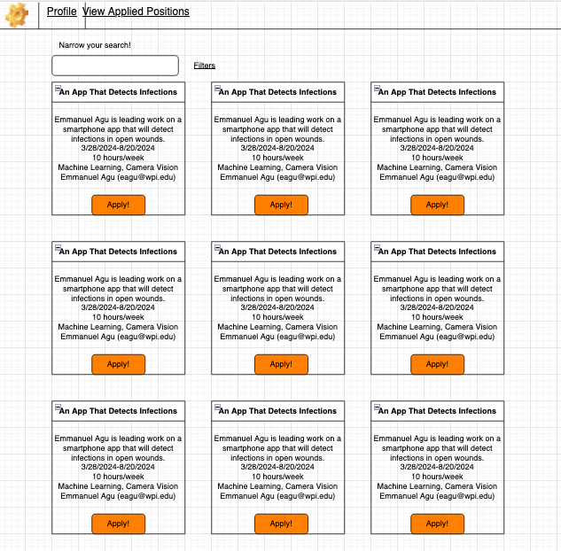
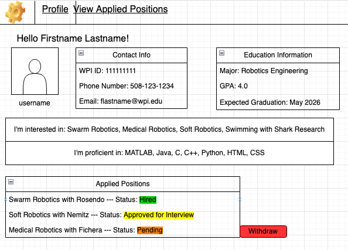
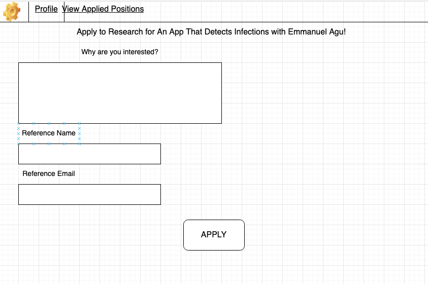
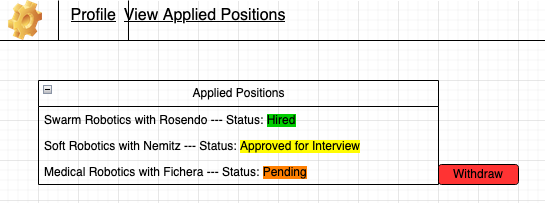
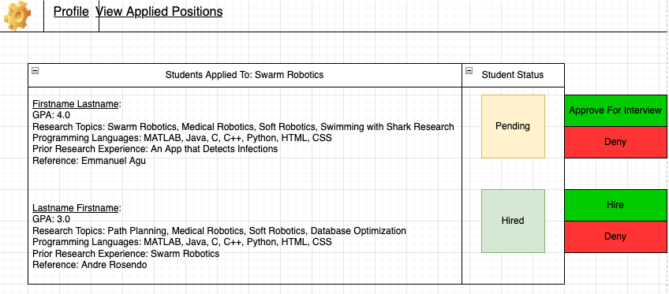
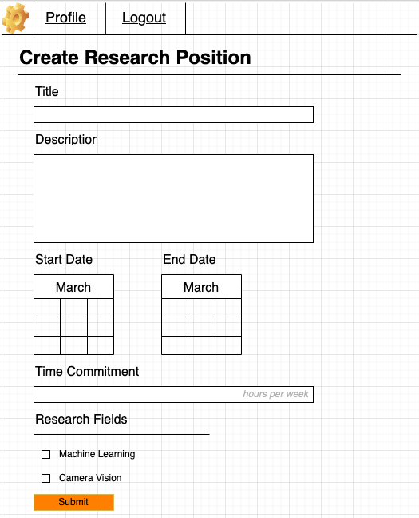

# Software Requirements and Use Cases

## ReConnect

---

Prepared by:

- `Jonathan Buwembo`,`AgileCodesters`
- `Amber Drinkwater`,`AgileCodesters`
- `Dennis Field`,`AgileCodesters`
- `Connor Jason`,`AgileCodesters`
- `Myrrh Khan`,`AgileCodesters`

---

**Course** : CS 3733 - Software Engineering

**Instructor**: Sakire Arslan Ay

---

## Table of Contents

- [1. Introduction](#1-introduction)
- [2. Requirements Specification](#2-requirements-specification)
- [2.1 Customer, Users, and Stakeholders](#21-customer-users-and-stakeholders)
- [2.2 User Stories](#22-user-stories)
- [2.3 Use Cases](#23-use-cases)
- [3. User Interface](#3-user-interface)
- [4. Product Backlog](#4-product-backlog)
- [4. References](#4-references)
- [Appendix: Grading Rubric](#appendix-grading-rubric)

## Document Revision History

| Name       | Date       | Changes            | Version |
| ---------- | ---------- | ------------------ | ------- |
| Revision 1 | 2024-03-28 | Initial draft      | 1.0     |
| Revision 2 | 2024-03-28 | Completed document | 2.0     |
|            |            |                    |         |

---

# 1. Introduction

Provide a short description of the software being specified. Describe its purpose, including relevant benefits, objectives, and goals.

This software serves as a platform to join qualified undergraduate students with faculty who are advertising research positions. The primary benefits of our platform will be faculty who do not teach lower-level courses, and thus are unlikely to connect with sophomore and junior students for these opportunities. By the time this software is implemented and being used, our goal is that faculty will have an easier time finding qualified undergraduate students to connect with, and students will have an easier time finding research opportunities that properly fit their skillset and interests.

---

# 2. Requirements Specification

This section specifies the software product's requirements. Specify all of the software requirements to a level of detail sufficient to enable designers to design a software system to satisfy those requirements, and to enable testers to test that the software system satisfies those requirements.

On the student page, a student user can:

1. Create a student account and enter the profile information:
   a. Enter account username and password
   b. Enter contact information (name, last name, WPI ID, email, phone)
   c. Enter additional information (major, cumulative GPA, expected graduation date, etc. )
   d. Select the research topics they are interested in (e.g., “Machine Learning”, “High
   Performance Computing”, etc.) You should assume a predetermined list of research
   fields and have the students choose among those.
   e. Choose the programming languages that they are familiar with. You should assume a
   predetermined list of programming languages and have the instructor choose among
   those.
2. Login with username and password.
3. View the open research positions.
   − Your app should list all open research positions.
   − In addition, it should identify the research positions that match the student’s
   “research interests” and list them separately under the “Recommended Research
   Positions”. You can implement a simple recommendation algorithm to find the
   matching positions. For example: If the student’s research interests include “Machine
   Learning”, the positions in that field should be recommended to the student. Similarly,
   if the position requires Python experience and if the student chose Python in their
   profile, the position should be recommended to the student.
4. For each research position, various information should be displayed:
   a. Research project title
   b. A brief description of the project goals and objectives
   c. Start date and end date
   d. Required time commitment (e.g., 10 hours per week)
   e. Research field(s) (e.g., “Machine Learning”, “High Performance Computing”, etc.)
   f. Required programming language experience (e.g., “C++”, “Java”, “Python”, etc.)
   g. The name and contact information of the faculty who posted the position.
5. Apply for research positions. A student can apply for more than one research position.
   For each position they apply to,
   − They should submit a brief statement describing why they are interested in this
   research topic and what they hope to gain by participating in that project.
   − They should provide the name and email of one faculty who can provide them a
   reference for the position.
6. View the research positions they already applied to and check the statuses of their
   applications.
   a. When the application is submitted, its status will appear as “Pending”.
   b. After a faculty accept this application, the status should be updated as “Approved for
   Interview”. Student would do the interview in person.
   c. After the interview, the faculty should update the status as either “Hired” or “Not
   hired”. Once updated, the changed status should be displayed on the student page.
7. Withdraw their “pending” applications.
   − If the student is no longer interested in a research position, they can withdraw their
   application.
   − If the status of the application is “Approved for Interview” or “Hired”, they can’t
   withdraw it

On the faculty page, a faculty user can:

1. Create a faculty account and enter profile information:
   − Set the account username and password
   − Enter contact information (name, last name, WPI ID, email, phone)
2. Login with username and password
3. Create undergraduate research positions. Faculty should enter the details of the
   position and qualifications needed, i.e.,:
   a. Research project title,
   b. A brief description of the project goals and objectives
   c. Start date and end date
   d. Required time commitment (e.g., 10 hours per week)
   e. Research field(s) (e.g., “Machine Learning”, “High Performance Computing”, etc.). You
   should assume a predetermined list of research fields and have the instructor choose
   among those.
   f. Required experience with programming languages (e.g., “C++”, “Java”, “Python”, etc.)
   You should assume a predetermined list of programming languages and have the
   instructor choose among those.
   Of course, a faculty can create more than one positions.
4. See the list of the students who applied for their positions.
   − A faculty should be informed about the other positions students are approved. If a
   student was “Approved for Interview” or was “Hired” for another position, those
   information should also be displayed.
5. View the qualifications of each student, i.e.,
   a. their GPAs,
   b. the research topics they are interested in,
   c. the programming languages they have experience with, and
   d. prior research experience,
   e. the reference student provided in their application
6. The faculty can approve the application of one or more students and the status of those
   applications should be updated as “Approved for Interview”.
7. After interviewing with the student, the faculty can update the status of applications as
   either “Hired” or “Not hired”

## 2.1 Customer, Users, and Stakeholders

A brief description of the customer, stakeholders, and users of your software.

The customers of our software would be colleges/universities interested in better connecting students and faculty together for research purposes.

The stakeholders of our software would be

The users of our software would be undergraduate students searching for research opportunities and faculty members looking to advertise research opportunities.

---

## 2.2 User Stories

This section will include the user stories you identified for your project. Make sure to write your user stories in the form :  
"As a **Role**, I want **Feature** so that **Reason/Benefit** "

**Research project title**  
As a student, I can view a research project’s title so that I can get a quick first impression of the research project.  
As a faculty member, I can share my project’s title to give students a very basic understanding of my project.

**A brief description of the project goals and objectives**  
As a faculty member, I can share the project’s goals and objectives to persuade any interested users to join my project.  
As a student, I can see the project’s goals and objectives to see if the project fits my interests.

**Start date and end date.**  
As a student, I can view the start and end dates to see if the project fits my schedule.  
As a faculty member, I can share the start and end dates to ensure that all students interested in the project immediately know if the project can fit their schedules or not.

**Required time commitment (e.g., 10 hours per week)**  
As a student, I can see the time commitment to further see if the project fits my schedule.
As a faculty member, I can share the time commitment so that interested students know what they are getting into.

**Research field(s) (e.g., “Machine Learning”, “High Performance Computing”, etc.)**
As a student, I can see the different research fields that match this research opportunity in order to make a holistic decision whether I want to apply.

**Required programming language experience (e.g., “C++”, “Java”, “Python”, etc.)**
As a student, I want to see the programming language experience required for this research role.

**The name and contact information of the faculty who posted the position.**
As a student, I can see the name and contact information of the faculty who posted this position clearly.  
As a student, I can see the department this faculty member works in.

**Apply for research positions. A student can apply for more than one research position. For each position they apply to,**  
As a student, I can submit a brief statement describing why they are interested in this research topic and what they hope to gain by participating in that project.  
As a student, I can share a brief statement of interest with the professors.
As a student, I can share another professor as a reference so that they can share their recommendations on my behalf.

---

## 2.3 Use Cases

This section will include the specification for your project in the form of use cases.

Group the related user stories and provide a use case for each user story group. You don't need to draw the use-case diagram for the use cases; you will only provide the textual descriptions. **Also, you don't need to include the use cases for "registration" and "login" use cases for both student and faculty users.**

- First, provide a short description of the actors involved (e.g., regular user, administrator, etc.) and then follow with a list of the use cases.
- Then, for each use case, include the following:

- Name,
- Participating actors,
- Entry condition(s) (in what system state is this use case applicable),
- Exit condition(s) (what is the system state after the use case is done),
- Flow of events (how will the user interact with the system; list the user actions and the system responses to those),
- Alternative flow of events (what are the exceptional cases in the flow of events and they will be handles)

Each use case should also have a field called "Iteration" where you specify in which iteration you plan to implement this feature.

You may use the following table template for your use cases. Copy-paste this table for each use case you will include in your document.

| Use Case #1                |                                                                                                                                                                                                                                                                                                                                                                                                                                                                                                                                                   |
| -------------------------- | ------------------------------------------------------------------------------------------------------------------------------------------------------------------------------------------------------------------------------------------------------------------------------------------------------------------------------------------------------------------------------------------------------------------------------------------------------------------------------------------------------------------------------------------------- |
| Name                       | Selecting a research position                                                                                                                                                                                                                                                                                                                                                                                                                                                                                                                     |
| Participating Actors       | Student, Professor, staff                                                                                                                                                                                                                                                                                                                                                                                                                                                                                                                         |
| Entry Conditions           | The student successfully logs in to the website.                                                                                                                                                                                                                                                                                                                                                                                                                                                                                                  |
| Exit Conditions            | The student can select the research position they like.                                                                                                                                                                                                                                                                                                                                                                                                                                                                                           |
| Flow of events             | 1. The student logs in to the website (assuming they have already registered).   2. The student is automatically brought to a webpage where they can see all research opportunities.   3. There is a menu option to select recommended research positions based on their information registered on the registration page.   4. The student can see all necessary information regarding the research position when selected.   5. The student can click an option to apply for the research opportunity.                               |
| Alternative Flow of Events | 1. The student logs in to the website (assuming they have already registered).   2. The student is automatically brought to a webpage where they can see all research opportunities.   3. Alternative Step: Before selecting recommended research positions, the student decides to filter the list of opportunities based on specific criteria (e.g., field of study, location, duration).   4. The student applies the filters, and the webpage refreshes to display only the research opportunities that match the selected criteria. |

| Use Case #2                |                                                                                                                                                                                                                                                                                                                                                                                                                                                                                                                                                                                                                                                                                                                                                                                                                                                                            |
| -------------------------- | -------------------------------------------------------------------------------------------------------------------------------------------------------------------------------------------------------------------------------------------------------------------------------------------------------------------------------------------------------------------------------------------------------------------------------------------------------------------------------------------------------------------------------------------------------------------------------------------------------------------------------------------------------------------------------------------------------------------------------------------------------------------------------------------------------------------------------------------------------------------------- |
| Name                       | Sharing a Project’s Goals and Objectives                                                                                                                                                                                                                                                                                                                                                                                                                                                                                                                                                                                                                                                                                                                                                                                                                                   |
| Participating Actors       | Faculty Member                                                                                                                                                                                                                                                                                                                                                                                                                                                                                                                                                                                                                                                                                                                                                                                                                                                             |
| Entry Conditions           | The faculty member has an account to successfully log in to the website.                                                                                                                                                                                                                                                                                                                                                                                                                                                                                                                                                                                                                                                                                                                                                                                                   |
| Exit Conditions            | The faculty member has special access to post research positions and only change their own research positions.                                                                                                                                                                                                                                                                                                                                                                                                                                                                                                                                                                                                                                                                                                                                                             |
| Flow of events             | 1. The staff member logs into their account.   2. The staff member creates a research position and fills out all the information required to submit that form.   3. The instructor selects the field(s) that pertain to the research position.   4. The instructor submits the research position.   5. The instructor can see the list of students applying for the position and their qualifications.                                                                                                                                                                                                                                                                                                                                                                                                                                                         |
| Alternative Flow of Events |   The staff member logs into their account. There is an option for the staff member to add a new position and see the list of positions they’ve already created, along with the number of students who applied. The staff member does not fill in all the information for the research position. An error message is flashed, and the form cannot be submitted.     The staff member initially logs into their account. There is an option for the staff member to add a new position and see the list of positions they’ve already created, along with the number of students who applied. The staff member fills out all needed information and submits the form. The staff member realizes they wish to make changes to their research position (e.g. deadline for position). They can click an edit option and update information for the position as needed. |

| Use Case #3                |                                                                                                                                                                                                                                                                                                                                                         |
| -------------------------- | ------------------------------------------------------------------------------------------------------------------------------------------------------------------------------------------------------------------------------------------------------------------------------------------------------------------------------------------------------- |
| Name                       | Generate List Applied Positions & See Status of Application                                                                                                                                                                                                                                                                                             |
| Participating Actors       | Student                                                                                                                                                                                                                                                                                                                                                 |
| Entry Conditions           | A student logs into their account                                                                                                                                                                                                                                                                                                                       |
| Exit Conditions            | A user can apply for a list of positions and see if they were “hired” or “not hired”                                                                                                                                                                                                                                                                    |
| Flow of events             | 1. The user logs into their account   2. The user sees recommendations and selects the research positions they wish.   3. The user navigates to a different page and sees the list of applied research positions. 3. The user sees the status of each applied research opportunity.                                                               |
| Alternative Flow of Events | The user logs into their account and is brought to the webpage to search for their research position. The user sees the status of each applied position and sees “denied” on their status tag. If the student finds that the the professor has not reviewed their application, they will see a “pending” message associated with the research position. |

| Use Case #4                |                                                                                                                                                                                                                                                                                                                                                                                                                  |
| -------------------------- | ---------------------------------------------------------------------------------------------------------------------------------------------------------------------------------------------------------------------------------------------------------------------------------------------------------------------------------------------------------------------------------------------------------------- | ----------------- |
| Name                       | Withdraw an application                                                                                                                                                                                                                                                                                                                                                                                          |
| Participating Actors       | Student                                                                                                                                                                                                                                                                                                                                                                                                          |
| Entry Conditions           | The student logs into the website                                                                                                                                                                                                                                                                                                                                                                                |
| Exit Conditions            | The student can successfully withdraw an application                                                                                                                                                                                                                                                                                                                                                             |
| Flow of events             | 1. The student logs in to the website (assuming they have already registered).   2. The student is automatically brought to a webpage where they can see all research opportunities.   3. There is a menu option to select to view their applied positions.   4. The student can see all the applications they created.   5. The student can click a button to withdraw from a research opportunity. | Alternative Step: |
| Alternative Flow of Events | If the student has not created any applications yet, they will not have the option to withdraw from anything on the account details page. Instead, it will prompt them to return to the home page and create an application.                                                                                                                                                                                     |

| Use Case #5                |                                                                                                                                                                                                                                                                                                                                                                     |
| -------------------------- | ------------------------------------------------------------------------------------------------------------------------------------------------------------------------------------------------------------------------------------------------------------------------------------------------------------------------------------------------------------------- |
| Name                       | Manage Research Positions                                                                                                                                                                                                                                                                                                                                           |
| Participating Actors       | Faculty                                                                                                                                                                                                                                                                                                                                                             |
| Entry Conditions           | The faculty logs into the website                                                                                                                                                                                                                                                                                                                                   |
| Exit Conditions            | The faculty member can delete, add and updated information for various research positions.                                                                                                                                                                                                                                                                          |
| Flow of events             | 1. The faculty member logs into the website.   2. The faculty member sees a page displayed before them of the list of positions that they have created.   3. The faculty member can click to edit the research position.   4. After they finish making the changes, they can submit the position.   5. A notification of success flashes on their page. |
| Alternative Flow of Events | The faculty member logs in to the website. A page appears for them to view all their created research position. They click to edit the position. If they write they give nonsensical information (e.g. dates set in the past) or miss any fields, an error message is flashed on their page.                                                                        |

| Use Case #6                |                                                                                                                                                                                                                                                                                                                                                                                                                                                                                                                |
| -------------------------- | -------------------------------------------------------------------------------------------------------------------------------------------------------------------------------------------------------------------------------------------------------------------------------------------------------------------------------------------------------------------------------------------------------------------------------------------------------------------------------------------------------------- |
| Name                       | Review Status of a Student’s Application                                                                                                                                                                                                                                                                                                                                                                                                                                                                       |
| Participating Actors       | Faculty                                                                                                                                                                                                                                                                                                                                                                                                                                                                                                        |
| Entry Conditions           | The faculty member successfully signs into the webpage                                                                                                                                                                                                                                                                                                                                                                                                                                                         |
| Exit Conditions            | The faculty member is able to deny or accept an applicant.                                                                                                                                                                                                                                                                                                                                                                                                                                                     |
| Flow of events             | 1. a faculty member selects from the list of research positions they created 2. The faculty member views a roster of all students applying for that position and select sone student. 3. Faculty members can view all the information about the student. 4. The faculty member selects an option to either “Not Hired” or “Hired”                                                                                                                                                                              |
| Alternative Flow of Events | Faculty member selects from the list of research positions they created. The faculty member can view the roster of students from a particular research opportunity, select one student and view all their information such as GPA, ID, Programming Experiences, and so forth. The faculty member can choose to send a message to the student if they need more time deciding. Additionally, the faculty member can decide to select multiple students at once if they all receive the same evaluation results. |

---

# 3. User Interface

Here you should include the sketches or mockups for the main parts of the interface.

---

# 4. Product Backlog

Here you should include a link to your GitHub repo issues page, i.e., your product backlog. Make sure to create an issue for each user story.

https://github.com/WPI-CS3733-2024D/team-agilecodesters/issues

---

# 5. References

Cite your references here.

For the papers you cite give the authors, the title of the article, the journal name, journal volume number, date of publication and inclusive page numbers. Giving only the URL for the journal is not appropriate.

For the websites, give the title, author (if applicable) and the website URL.

---

---
